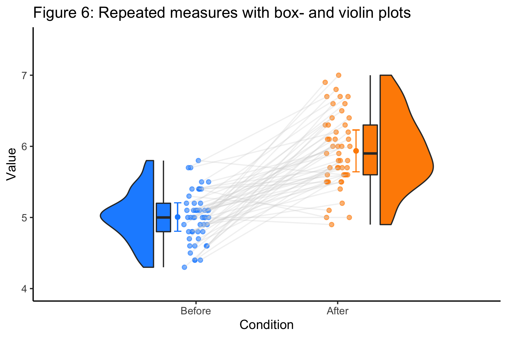

# open-visualizations

Visualizations based on best open science practices.

This repository currently includes visualizations made with:
- Python (.ipynb)
- R (.rmd)

# Interactive tutorials
Both Python tutorials are directly available through Binder. Click on the Binder launcher to open them!

# Background
The idea behind the ‘open-visualizations’ repository stems from the fact that (open) science - in general - lacks ‘fully’ transparent and robust visualizations, i.e., figures have always some form of ‘hidden-data’. To overcome this issue, I created this repository. Some of the work in R is inspired by work from Allen et al. (2019)(https://github.com/RainCloudPlots/RainCloudPlots)

There is a zenodo (https://doi.org/10.5281/zenodo.3715538) archive of the code and this repository is made available under the MIT license i.e., you can do with it what you want, but if you use it, reference needs to be given to the author of this repository (see DOI above).

I hope that these tutorials are helpful for your research and if you have any questions, suggestions for improvement - I'm nor R nor Python Pro - or identify bugs, please open an issue in this repository.   
